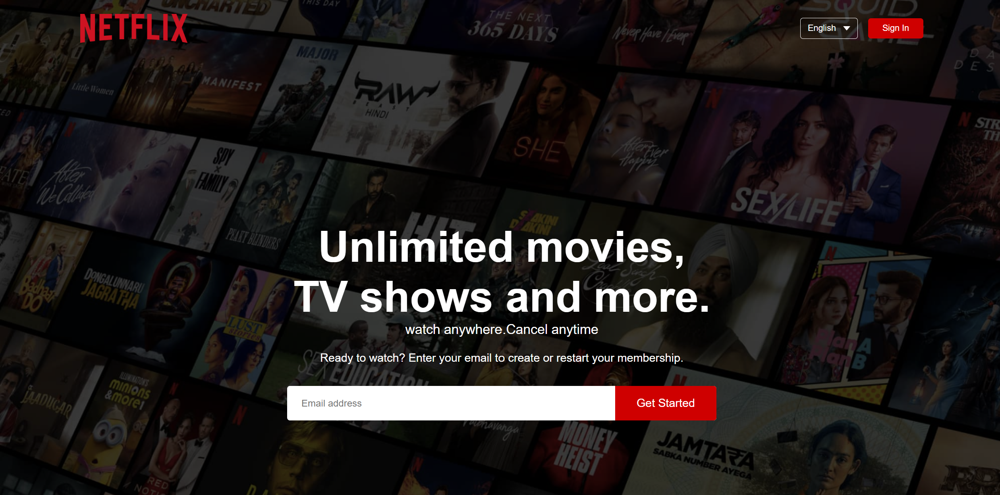

# Netflix Web App Clone

## Introduction
This document outlines the features and design of a Netflix clone web application.

## Front Page 

*Description: This image showcases the front page of the Netflix clone, featuring a carousel of popular movies and TV shows.*

## Second Page

*Description: Here, users can explore different genres and categories of content available on the platform.*

## Third Page

*Description: The third page displays personalized recommendations based on the user's viewing history and preferences.*

## Footer

*Description: This image highlights the footer section of the Netflix clone, containing links to various pages and legal information.*

## Mobile & Tablet Responsive View

*Description: The Netflix clone is designed to be responsive, providing a seamless viewing experience across different devices.*

*Description: Another example of the responsive design, showing how the content adapts for mobile and tablet users.*

